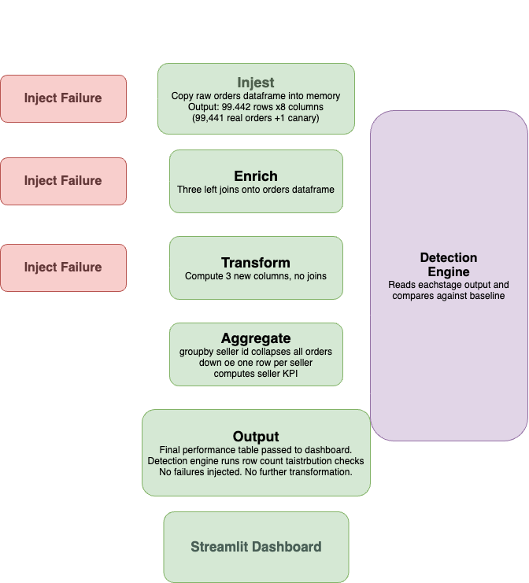

# Silent Failure Detector

A monitoring system that detects silent data pipeline failures using the real Olist Brazilian e-commerce dataset.

> **The problem:** Pipelines fail in two ways. Loudly — you get an error and fix it. Silently — the pipeline completes successfully, dashboards stay green, but the underlying data is wrong and nobody knows. This project catches the second kind.



---

## What It Detects

| Failure Type | What It Simulates |
|---|---|
| Record Drop | Rows silently disappear — broken join, partial read, silent limit |
| Stale Timestamps | All timestamps frozen to a past date — cache stopped updating |
| Null Flood | A column fills with NaNs — upstream source sending incomplete records |
| Price Corruption | Prices set to 0 or negative — currency bug, bad default value |
| Duplicate Records | Rows silently duplicated — inflates counts and revenue |
| Schema Drift | Numeric column cast to string — upstream format change |
| Canary Removal | Sentinel record disappears — filter bug eating specific rows |

---

## How It Works

The system loads the Olist CSVs once and runs the data through a 5-stage pipeline twice — once clean to establish a baseline, once with a failure injected. The detection engine compares the two across every column at every stage. The pipeline always completes without errors regardless of what is injected. That is the point — the failures are silent.

---

## Pipeline Stages

Each stage is a Python function that takes a dataframe in and returns a dataframe out. The data gets progressively richer as it flows through. A failure injected at stage 1 quietly propagates and distorts every subsequent stage.

### Stage 1 — Ingest

The simplest stage. We take the raw orders table and return it. In a real pipeline this is where you would read from S3 or a database. Here we copy the orders dataframe.

This is where record drops, stale timestamps, and canary removal are injected — because these are the kinds of things that go wrong at the source, before any processing has happened.

### Stage 2 — Enrich

This is where we join everything together. We take the orders from stage 1 and attach customer details, order items, and payment info onto each row.

```
orders
  → merge customers  (on customer_id)
  → merge items      (on order_id)
  → merge payments   (on order_id)
```

After this stage, each row represents one order with everything we know about it — who bought it, what they bought, how they paid, how much it cost.

This is where null floods and duplicate injections happen — because these are join-related failures. A bad join produces nulls, a repeated join produces duplicates.

### Stage 3 — Transform

We do not change the shape of the data here — same rows, same join keys. Instead we calculate new columns from existing ones:

- `delivery_days` — how many days from purchase to delivery
- `is_late` — whether the order arrived after the estimated delivery date
- `total_order_value` — price plus freight value

This is where schema drift is injected — because if `price` got silently cast to string in stage 2, the addition `price + freight_value` here will silently produce NaN instead of crashing.

### Stage 4 — Aggregate

This is the final transformation — we collapse everything down to one row per seller. All the order-level detail gets summarised into KPIs:

```
total_orders        — how many orders this seller fulfilled
total_revenue       — sum of all order values
avg_delivery_days   — average time from purchase to delivery
late_delivery_rate  — fraction of orders that arrived late
avg_review_score    — average customer review score
```

This is the stage that matters most to the business. If anything went wrong upstream — dropped records, corrupted prices, duplicate items — it all shows up here as wrong numbers. But the table looks fine. No errors, no nulls, just wrong KPIs.

### The progression in one line

```
raw orders → joined with everything → calculated metrics → summarised by seller
```

---

## Detection Checks

The detection engine automatically classifies every column as numeric, datetime, categorical, or ID — then runs the appropriate checks at each stage. 98 checks run in total on a clean pipeline.

| Check | What It Measures | Severity |
|---|---|---|
| Row Count | Volume drop > 10% or spike > 20% vs baseline | Critical / Warning |
| Null Rate | Column null rate exceeds per-column threshold | Warning |
| Distribution | Mean drift > 30% or any negative values | Critical / Warning |
| Timestamp Freshness | All identical timestamps or year below threshold | Critical / Warning |
| Canary Record | Sentinel record ORD_CANARY_001 missing from stage | Critical |
| Cross-Stage Leakage | Order IDs present upstream but missing downstream | Critical / Warning |
| Category Drift | New categorical values not seen in baseline | Warning |

All thresholds are documented in `THRESHOLDS.md`.

---

## How to Run

**Step 1 — Download the dataset**

Get the Olist dataset from [Kaggle](https://www.kaggle.com/datasets/olistbr/brazilian-ecommerce). Extract the 7 CSV files into a `data/` folder inside your project directory.

**Step 2 — Project structure**

```
project/
├── data/
│   ├── olist_orders_dataset.csv
│   ├── olist_order_items_dataset.csv
│   ├── olist_order_payments_dataset.csv
│   ├── olist_order_reviews_dataset.csv
│   ├── olist_customers_dataset.csv
│   ├── olist_sellers_dataset.csv
│   └── olist_products_dataset.csv
├── pipeline_simulator.py
├── detection_engine.py
├── dashboard.py
├── THRESHOLDS.md
└── requirements.txt
```

**Step 3 — Install dependencies**

```bash
pip install -r requirements.txt
```

**Step 4 — Run**

```bash
streamlit run dashboard.py
```

---

## Dashboard Guide

### The Sidebar — Failure Injection

This is where you control what goes wrong. Each toggle injects a specific silent failure into the pipeline when you hit Run. If nothing is toggled, the pipeline runs clean. The sliders under each toggle control the intensity — how many rows to drop, how high the null rate goes.

### How to Tell If the Pipeline Ran Successfully

The pipeline itself always runs successfully — that is the whole point of silent failures. You will never see a crash or an error message from the pipeline itself.

What tells you the **data** is healthy is the detector. You want to see:

- Overall Health at 100% or close to it
- Zero criticals
- Zero or very few warnings
- The green banner: *"No failures injected — clean run baseline"*

If you see criticals, the pipeline completed but the data coming out of it is wrong.

### Top Metrics Row

Five numbers giving you a first-glance summary after a run:

- **Overall Health %** — what percentage of all checks across all stages passed. 100% means nothing suspicious was found.
- **Checks Run** — total number of individual checks that executed across all stages.
- **Passed** — how many checks returned passed.
- **Critical** — definitive failures. Act on these immediately.
- **Warnings** — suspicious but could have an innocent explanation. Investigate.

### Stage Health Bar Chart

A horizontal bar for each stage showing its health percentage. Green means all checks passed. Orange means some warnings. Red means critical failures.

This tells you *where* in the pipeline something went wrong. A failure at stage 1 ingest looks different from a failure at stage 3 transform — and knowing which stage is the starting point for investigation.

When you inject a record drop for example, you will see stage 1 go red immediately because that is where the drop happens. Every subsequent stage also shows degraded health because the dropped records propagate forward.

### Row Counts Chart

Two bars side by side for each stage — blue for baseline, red for the current run.

This is the most visual representation of record drop and duplicate injection. A clean run shows both bars at identical height across all stages. Inject a 25% record drop and the red bars shrink noticeably from stage 1 onward. Inject duplicates and the red bars spike above the blue at the enrich stage where items get duplicated.

It also shows something important about the pipeline structure — the enrich stage naturally has more rows than ingest because of the joins. That is normal and expected.

### Check Type Matrix

A heatmap where rows are check types and columns are stages. Green cells passed, orange is a warning, red is critical.

This gives you the full picture in one view. You can immediately see which specific check failed at which specific stage. For example if you inject null flood, you will see the null rate cell go orange at stage 2 and stay orange at stages 3 and 4 because the nulls propagate forward.

### Column Health Matrix

A heatmap where rows are dataset columns and columns are pipeline stages. This is where you trace exactly which column first becomes unhealthy and how far the corruption travels downstream. Grey cells mean the column does not exist at that stage yet.

### Stage-by-Stage Detail

The most detailed section. Each stage is an expandable panel showing every individual check with its badge, message, and expected vs actual values.

This is where you read the human explanation of what went wrong. Not just "something failed at stage 2" but "null rate for customer_state is 42.3% when we expected less than 5%." That is actionable information.

### Run History Table

Every time you hit Run, a row gets added showing the timestamp, how many failures were injected, the overall health, and the critical and warning counts. This lets you compare runs — inject one failure, note the health score, add another, see how the score changes.

### Raw Stage Data Explorer

A dropdown where you can select any stage and browse the actual dataframe up to 100 rows. This is your ground truth. If the detector flags negative prices at stage 3, you can come here, select stage 3, and see the -99.99 values in the price column with your own eyes.

### A Concrete Example

Say you toggle Record Drop at 25% and hit Run:

- The red banner tells you failures were injected silently
- Overall health drops — around 60%
- The stage health chart shows stage 1 in red
- The row count chart shows all red bars significantly shorter than blue
- The check matrix shows row_count_drop cells red across multiple stages
- Stage-by-stage detail shows "Row count dropped 22.6% from baseline" at stage 1 with cascading warnings at every subsequent stage
- The raw data explorer at stage 1 shows noticeably fewer rows than the baseline

The pipeline reported no errors. Everything completed. But the dashboard caught it.

---

## Known Limitations

- **Single dataset baseline.** The baseline is one clean run of the same dataset, not a rolling historical average. The detector compares the pipeline against itself rather than against genuine historical variation.
- **Fixed thresholds.** All detection thresholds are hardcoded in `THRESHOLDS.md`. They do not adapt to natural seasonal variation in the data over time.
- **No time dimension.** Every run is isolated. The run history table accumulates within a single session only and resets when you restart Streamlit.

---

## Version 2 — Coming

Version 2 addresses all three limitations by introducing a time dimension and a learned baseline:

- A **time simulation layer** that slices the Olist data by date and simulates 60+ daily pipeline runs
- A **metadata store** that accumulates a summary row after each run
- A **rolling baseline engine** that computes dynamic thresholds from run history — mean ± N standard deviations rather than hardcoded values
- An **ML anomaly detection layer** that learns what normal looks like without requiring hardcoded thresholds

---

## Dataset

[Brazilian E-Commerce Public Dataset by Olist](https://www.kaggle.com/datasets/olistbr/brazilian-ecommerce) — 99,441 orders from 2016–2018 across a Brazilian marketplace platform.
