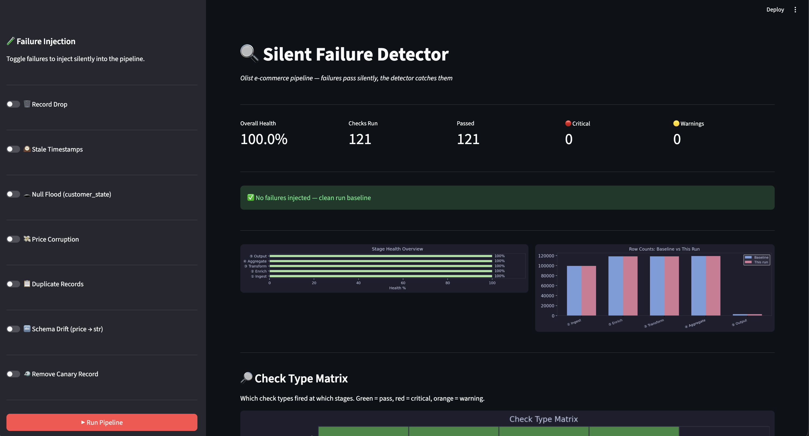
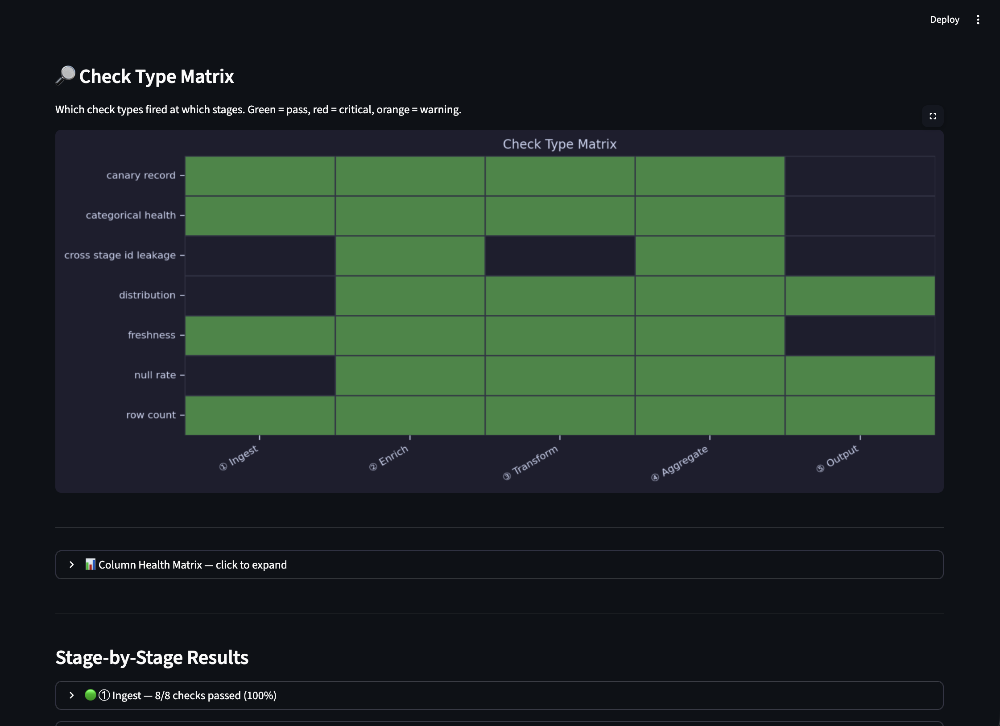
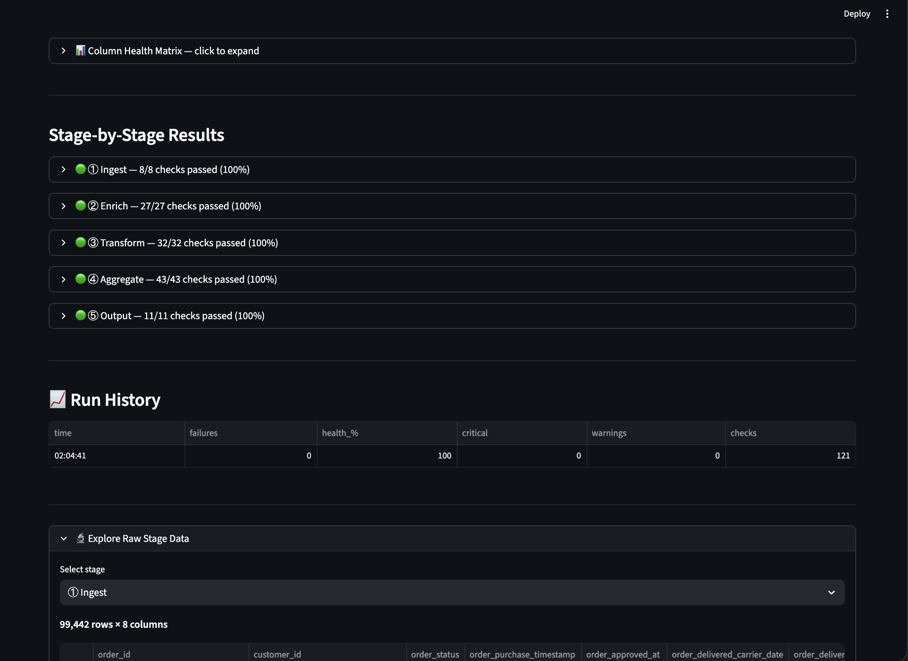

# Silent Failure Monitor — Dashboard

A Streamlit dashboard for monitoring silent failures in a sales data pipeline.

→ [Full documentation](https://github.com/ChibuikeOnuba/ETL-Pipeline-Silent-Failure-Detection/blob/main/silent_failure_monitor.pdf)

---

### Overview

---

### Check Type Matrix & Stage Results

---

### Run History & Raw Data Explorer

